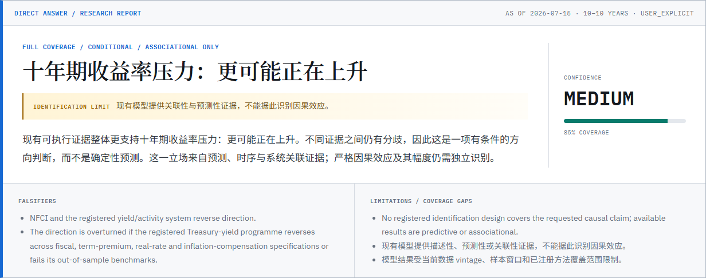
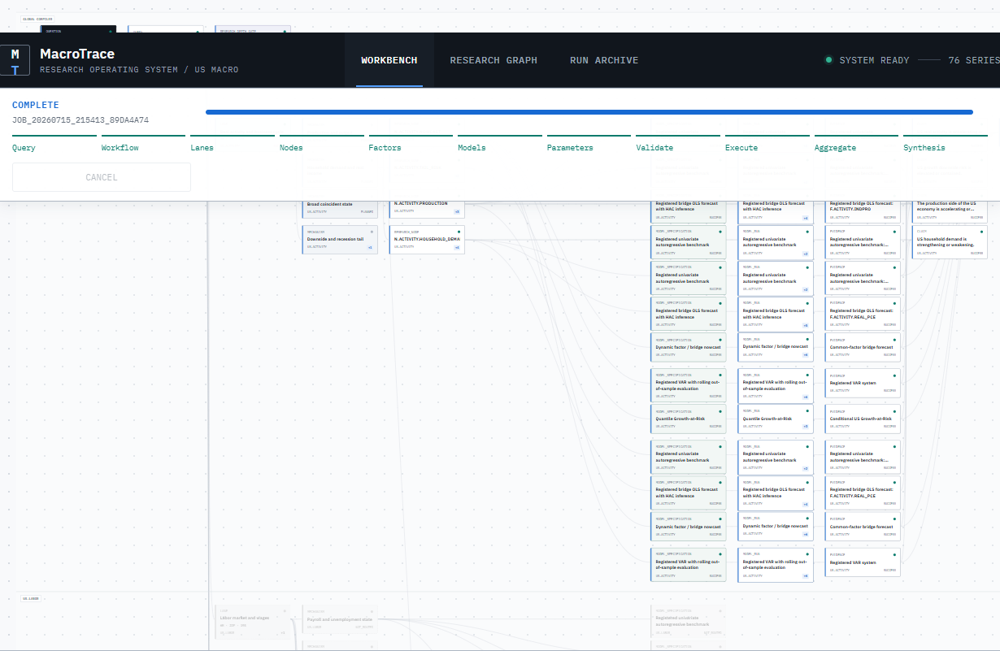
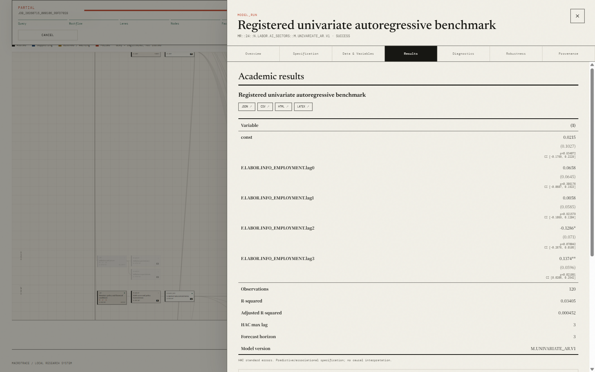
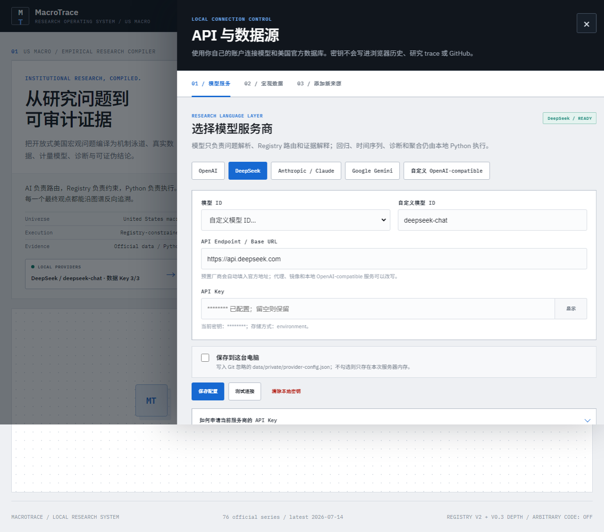
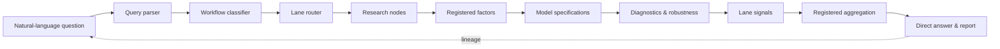
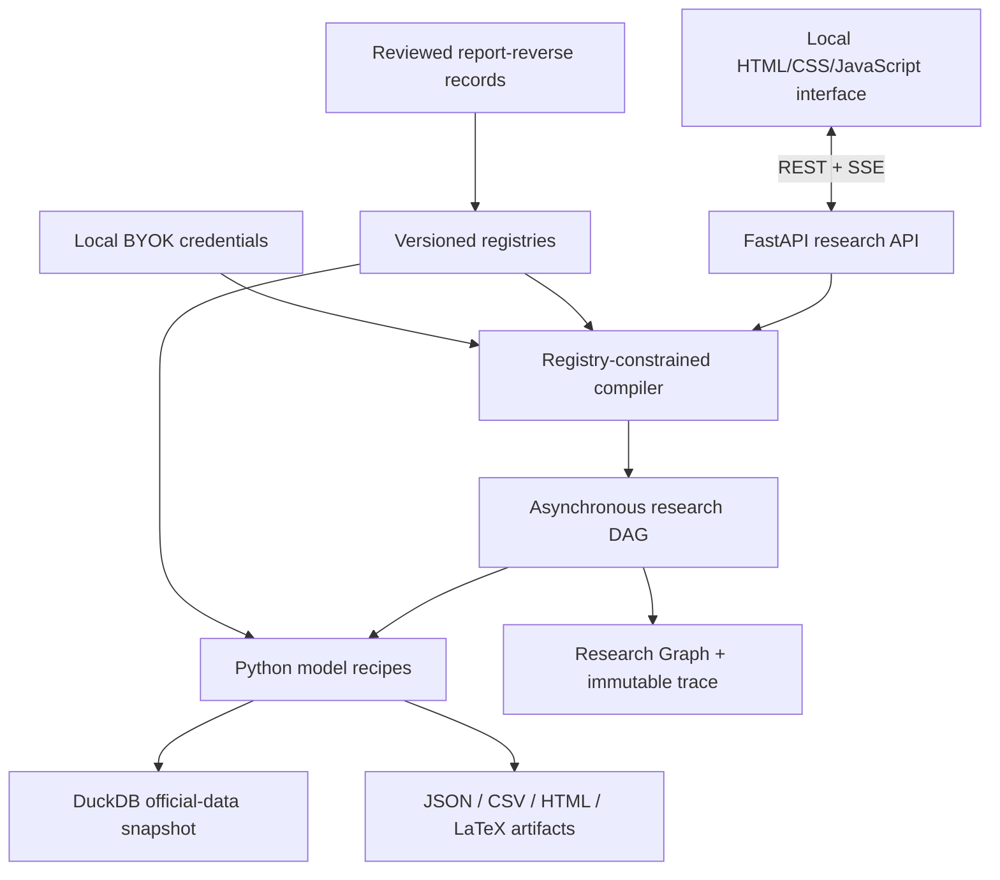

<div align="center">

# MacroTrace

### Compile open-ended US macro questions into real-data models, diagnostics, and an auditable research graph.

[](https://github.com/ZhenyuanPAN822/macrotrace/releases)
[](https://github.com/ZhenyuanPAN822/macrotrace/actions)
[](https://www.python.org/)
[](./LICENSE)
[](#quick-start)

[中文说明](./README.zh-CN.md) · [Quick start](#quick-start) · [Architecture](#architecture) · [Report reverse engineering](#reverse-engineer-more-research)



</div>

## MacroTrace makes macro AI run empirical research

Most macro AI workflows still fall into two broad categories:

- **AI agents inside data terminals such as Wind or iFinD** are strong at searching proprietary databases and organizing data, news, and research into a language-layer brief. Their typical workflow does not automatically turn an open question into a coordinated battery of panel regressions, time-series systems, and forecasting models.
- **General tools such as ChatGPT, Codex, or Claude Code** can write code and run a one-off regression, but they do not arrive with a stable, registered macro research framework. Without detailed instructions, the work often begins with a small set of sources, one indicator, or a simple model.

MacroTrace supplies the missing layer: **a white-box empirical system built specifically for US domestic macro research.**

After a user asks a natural-language question, MacroTrace does three things.

### 1. Identify the economic mechanisms

It does not search a handful of series and jump to prose. It identifies mechanisms such as inflation formation, monetary transmission, labor-market adjustment, the credit cycle, housing, and economic growth, then decomposes them into observable and testable components.

### 2. Convert serious macro research into reusable research routes

A standardized semantic reverse-engineering workflow extracts problem definitions, mechanism frameworks, indicator choices, data combinations, model specifications, diagnostics, and decision rules from institutional reports, policy documents, papers, books, and research web pages. These become reusable lanes, nodes, factors, specifications, and aggregation paths.

The workflow is designed to scale to hundreds or thousands of sources. The public prototype currently includes **30 new reviewed records**—10 institutional PDFs, 10 institutional web resources, and 10 foundational papers or books—plus the original **11-report registry**. A new US macro question therefore calls registered empirical routes instead of improvising methods at runtime.

### 3. Build a macro view from mechanism components

For an inflation question, MacroTrace can decompose the problem into demand, labor, wages, productivity, housing, supply chains, energy, and inflation expectations. It can then:

- use consumption, retail sales, fiscal spending, and credit data in VAR or Local Projection systems to estimate the path and persistence of demand shocks;
- combine vacancies, quits, unemployment, and wages in registered Phillips-curve, bridge, or panel specifications;
- use state, industry, or city panels when a reviewed route and suitable cross-sectional data exist;
- extract latent expectations and common states from surveys, market breakevens, and inflation history with state-space or Dynamic Factor methods;
- run registered VAR, Local Projection, panel, state-space, and reviewed machine-learning recipes with parameter estimation, shock decomposition, diagnostics, and time-ordered out-of-sample tests.

Component results become mechanism-level judgments—such as whether demand, wage, or housing inflation is strengthening—and those judgments are cross-checked before MacroTrace forms a direct macro view.

```text
Natural-language question → economic mechanisms → mechanism components
→ data and models → empirical interpretation and forecasts
→ mechanism judgments → integrated macro view
```

Every final conclusion can be traced down to its data, variables, model, parameters, diagnostics, and empirical results. Every analysis can be opened to inspect its formula, estimation process, academic table, and provenance.

The public release is a working local application rather than a hosted website. It is intended to help:

- **small buy-side teams, family offices, and independent macro investors** assess economic releases, policy changes, and potential asset-price transmission with auditable evidence;
- **wealth advisors and RIAs** build allocation narratives from visible analysis while reducing research and client-communication time;
- **crypto and DeFi investment teams without a dedicated macro researcher** turn changes in rates, liquidity, the dollar, inflation, and risk appetite into an inspectable macro-risk view.

MacroTrace is a local-first, white-box macro research compiler. Ask a natural-language question such as:

> Is US fiscal expansion increasing pressure on the 10-year Treasury yield?

MacroTrace parses the target and horizon, routes the question through registered economic lanes, selects compatible factors and model recipes, runs Python against official observations, checks method-specific diagnostics, aggregates the resulting evidence, and produces both a direct answer and a graph you can inspect node by node.

The language model is a constrained router and interpreter. It does not write statistical code, invent variables, or generate numerical weights.

## Table of contents

- [Why MacroTrace](#why-macrotrace)
- [What is included](#what-is-included)
- [Demo](#demo)
- [Quick start](#quick-start)
- [Example research flow](#example-research-flow)
- [Architecture](#architecture)
- [Bring your own APIs](#bring-your-own-apis)
- [Reverse-engineer more research](#reverse-engineer-more-research)
- [API](#api)
- [Project structure](#project-structure)
- [Verification](#verification)
- [Limitations](#limitations)
- [Roadmap](#roadmap)

## Why MacroTrace

| Approach | Open-ended questions | Real statistical execution | Method diagnostics | Inspectable lineage | Registry guardrails |
|---|---:|---:|---:|---:|---:|
| General macro chatbot | Yes | Usually no | No | No | No |
| Notebook or one-off script | Limited | Yes | If authored | Partial | Manual |
| Dashboard with fixed indicators | No | Sometimes | Rarely | Partial | Fixed UI |
| **MacroTrace** | **Yes** | **Yes** | **Recipe-specific** | **Question → claim** | **Yes** |

MacroTrace is designed for economists, macro researchers, students, and technically curious investors who want an answer they can audit instead of a fluent black box.

## What is included

- A layered query compiler: parser, workflow classifier, lane router, node router, factor selector, model planner, local parameter agent, and evidence-bound synthesis.
- A versioned research registry with **10 lanes, 31 mechanisms, 55 factors, 82 model specifications, 30 research nodes, and 6 workflows**.
- Real Python recipes for dynamic-factor/bridge nowcasts, registered VAR systems, local projections, quantile Growth-at-Risk, bridge OLS, autoregressive benchmarks, and a panel fixed-effects fixture.
- Method-specific results, diagnostics, robustness checks, academic three-line tables, charts, provenance, parameter decisions, and artifact hashes.
- A Research Graph that keeps unselected lanes visible, highlights routed paths, and lets every final claim be traced back to data and specifications.
- **30 Codex-reviewed reverse-engineering records**: 10 institutional reports, 10 institutional web resources, and 10 foundational papers/books, plus the original 11-report registry.
- A local “API & data sources” workspace for OpenAI, DeepSeek, Anthropic, Gemini, custom OpenAI-compatible endpoints, and official macro-data credentials.
- A privacy-clean official-data snapshot distributed as a separate GitHub Release asset.

## Demo







<details>
<summary><strong>Animated walkthrough</strong></summary>


</details>

## Quick start

### Requirements

- Windows 10/11 with PowerShell
- Python 3.11 or newer
- Internet access for the first dependency and snapshot download

### Install and open

```powershell
git clone https://github.com/ZhenyuanPAN822/macrotrace.git
Set-Location macrotrace
powershell -ExecutionPolicy Bypass -File .\scripts\setup_mvp.ps1
powershell -ExecutionPolicy Bypass -File .\scripts\start_macrotrace.ps1
```

The setup script creates a local virtual environment, installs dependencies, downloads the reviewed official-data snapshot from the latest GitHub Release, and runs the test suite. The start script opens the browser and keeps the local server in the current terminal:

- App: `http://127.0.0.1:8000/`
- OpenAPI: `http://127.0.0.1:8000/docs`

Press `Ctrl+C` in that terminal to stop the server. To start without opening a browser:

```powershell
.\scripts\start_macrotrace.ps1 -NoBrowser
```

Useful setup options:

```powershell
# Install without downloading the release snapshot
.\scripts\setup_mvp.ps1 -SkipSnapshot

# Refresh official data after configuring your own provider keys
.\scripts\setup_mvp.ps1 -SyncData
```

## Example research flow



The fixed graph vocabulary is:

```text
QUESTION → QUERY → CLAIM → LANE → RESEARCH_NODE → FACTOR
→ DATASET → TRANSFORM → MODEL_RUN → DIAGNOSTIC → EVIDENCE
→ LANE_SIGNAL → AGGREGATION → FINAL_CLAIM → FALSIFIER
```

For a large question, MacroTrace can schedule dozens of registered specifications across multiple mechanisms. Descriptive statistics, momentum, quantiles, and z-scores may support a factor, but cannot independently support a broad macro conclusion.

## Architecture



Numeric analysis is deterministic Python. The LLM may interpret the research question and explain completed evidence, but it cannot bypass registry compatibility rules or modify formula code.

## Bring your own APIs

Open **API & data sources** on the home screen. Keys can be session-only or saved locally to `data/private/provider-config.json`, which is ignored by Git.

Supported model-provider presets:

- OpenAI
- DeepSeek
- Anthropic / Claude
- Google Gemini
- Custom OpenAI-compatible HTTPS endpoint

Supported official-data key slots include FRED, BLS, EIA, BEA, and Census. Treasury and New York Fed routes used by the bundled snapshot do not require a user key. The interface includes application links and connection checks.

Never commit `.env.local`, `data/private/`, screenshots containing credentials, or raw provider responses.

## Reverse-engineer more research

The public prototype already includes reviewed semantic records. To add a paper or report locally:

```powershell
.\.venv\Scripts\python.exe .\scripts\report_pipeline.py --help
```

The workflow is intentionally staged:

1. Fingerprint and privately extract the source.
2. Read it semantically and map question → lanes → mechanisms → nodes → factors → data → models → diagnostics → aggregation.
3. Run an independent review pass.
4. Verify page citations, variable definitions, method fit, and free-data feasibility.
5. Produce a changeset without mutating the live registry.
6. Apply only a content-hash-matched approved changeset, with rollback.

See [the report ingestion contract](./docs/08_report_ingestion_workflow_v1.md) and [the extraction prompt](./report_pipeline/prompts/reverse_extraction_v1.md). Word frequency and automatic summarization are not substitutes for semantic reverse engineering.

## API

Core endpoints:

```text
POST /v1/research-jobs
GET  /v1/research-jobs/{id}
GET  /v1/research-jobs/{id}/graph
GET  /v1/research-jobs/{id}/events
GET  /v1/research-jobs/{id}/plan
GET  /v1/research-jobs/{id}/result
GET  /v1/research-jobs/{id}/trace
GET  /v1/research-jobs/{id}/nodes/{node_id}
GET  /v1/artifacts/{artifact_id}
POST /v1/research-jobs/{id}/cancel
```

Example:

```powershell
$body = @{
  question = "Is US fiscal expansion increasing pressure on the 10-year Treasury yield?"
} | ConvertTo-Json

$job = Invoke-RestMethod `
  -Method Post `
  -Uri http://127.0.0.1:8000/v1/research-jobs `
  -ContentType application/json `
  -Body $body

Invoke-RestMethod "http://127.0.0.1:8000/v1/research-jobs/$($job.job_id)"
```

## Project structure

```text
backend/app/                 FastAPI, compiler, models, diagnostics, jobs
frontend/                    Local research interface and graph renderer
registry/v2/                 Versioned lanes, factors, models, routes, claims
report_pipeline/             Reviewed records, prompts, and examples
schemas/                     Research-job and report-ingestion contracts
scripts/                     Setup, local server, sync, report pipeline, validation
tests/                       Statistical, registry, API, and security tests
docs/                        Architecture, method atlas, reverse workflow
```

## Verification

```powershell
.\.venv\Scripts\python.exe -m pytest -q
.\.venv\Scripts\python.exe -m compileall backend
node --check .\frontend\app.js
.\.venv\Scripts\python.exe .\scripts\validate_blueprint.py
```

The release builder fails closed if the public source contains a secret-shaped value, personal filesystem path, environment file, database, research history, cache, or log.

## Limitations

- The bundled data is a reviewed snapshot, not a continuously maintained real-time data service.
- “As of” filtering does not turn every source into a complete historical-vintage warehouse. Revision risk is disclosed in provenance.
- Some open-ended questions remain partial when a registered treatment, counterfactual, dataset, or identification design is unavailable.
- Association and forecast evidence are not relabeled as identified causal effects.
- The current panel fixed-effects workflow is a test fixture unless a reviewed report route explicitly activates it.
- Local credentials are protected from Git and public API responses, but persistent keys are still plaintext on the user’s own machine.
- This is research software, not investment advice.

## Roadmap

- Add more reviewed US macro workflows and official-data connectors.
- Expand genuine vintage and release-calendar handling.
- Activate additional causal recipes only after report-backed identification and synthetic-DGP verification.
- Add cross-platform launch scripts and a reproducible containerized local profile.
- Improve model-set calibration and time-ordered out-of-sample aggregation.

## License

[MIT](./LICENSE). Third-party data remain subject to their source terms.

If the white-box research graph is useful to you, star the repository and open an issue with a macro question the current registry cannot yet compile honestly.
