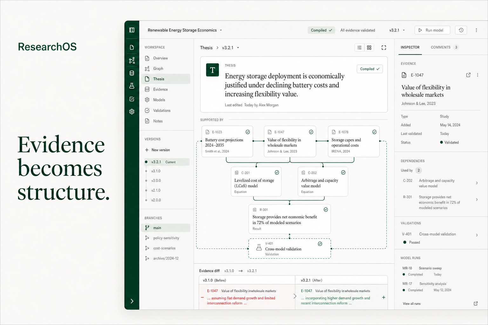
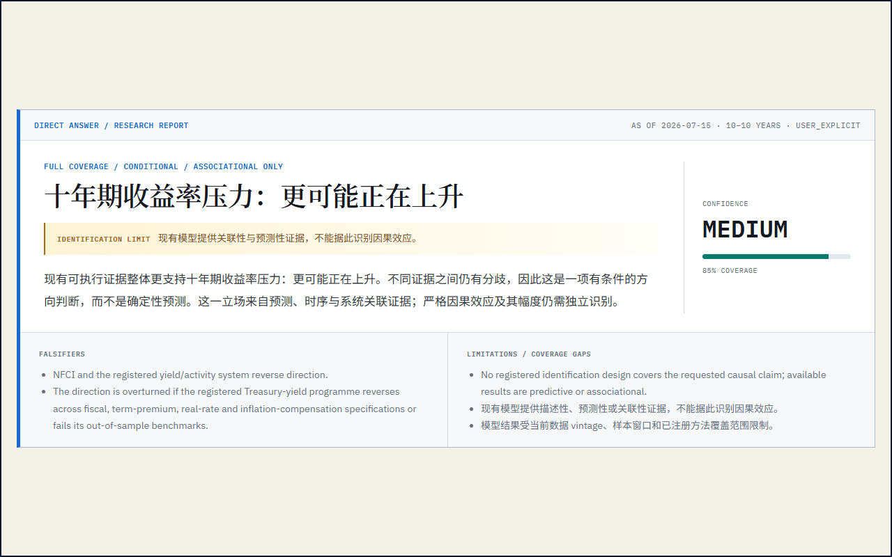
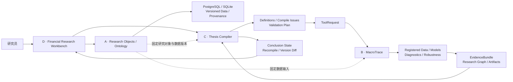

<div align="center">


# 研构 ResearchOS

### 从自然语言问题，到可执行、可复现、可审计的金融实证研究。


[产品概览](#产品概览) · [行业对比](#传统金融数据服务通用-ai-与-researchos) · [研究流程](#一个问题如何进入研究流程) · [产品演示](#产品演示) · [系统架构](#系统架构) · [项目结构](#项目结构)



</div>

## 产品概览

金融研究通常横跨数据终端、机构研报、公开信息、Excel、Python、Notebook、Word 与 PPT。研究员需要自行衔接数据口径、分析方法、模型输出、引用来源和最终表述。材料或数据更新后，旧结论的适用范围也需要重新检查。

**研构 ResearchOS** 连接研究问题、数据、模型、证据与结论。研究员提出自然语言问题后，系统组织研究上下文，生成验证计划，调用注册化数据与实证工具，执行诊断和稳健性检查，再按照证据等级编译结论。

> **一句话理解：**ResearchOS 把自然语言研究问题转化为可执行、可复现、可审计的金融实证分析。

产品面向金融研究院、券商、银行、资管、买方团队以及需要快速形成并持续更新研究判断的分析人员。

## 传统金融数据服务、通用 AI 与 ResearchOS

现有金融 AI 工作流大致分成两类。

### 金融数据终端中的 AI Agent

Wind、iFinD 等金融数据服务商积累了广泛的数据、资讯、研报与终端工具。其 AI Agent 擅长检索平台数据、整理市场信息、调用已有指标并生成语言层面的分析。面对开放式研究问题时，多组模型的组织、识别策略、诊断流程和结论约束通常仍由研究员配置，或交由独立量化模块完成。

### 通用 AI 工具

ChatGPT、Codex、Claude Code 等通用工具能够检索资料、编写代码并完成单次分析。缺少稳定的金融研究框架时，数据选择、变量定义、模型规格、诊断方法和证据等级容易随提示词变化，研究过程也常停留在一次性脚本或单轮对话中。

### ResearchOS 补充研究执行层

ResearchOS 将金融数据服务、AI 研究助手、注册化实证工具和 Thesis Compiler 接入同一条研究流水线。数据终端继续提供数据与信息优势；通用模型负责问题理解、资料组织和受限路由；确定性代码负责数据处理、统计执行、诊断与结果记录；Thesis Compiler 根据证据边界调整结论语言。

| 维度 | Wind / iFinD 等金融数据服务 | 通用 AI 工具 | **ResearchOS** |
| --- | --- | --- | --- |
| 主要优势 | 数据、资讯、研报、指标与终端生态 | 自然语言交互、检索、代码生成与通用推理 | 研究编译、实证执行、证据约束与可追溯结果 |
| 开放问题处理 | AI 检索与终端功能辅助，研究员组织分析路径 | 根据提示词临时规划 | 编译为机制、变量、数据、模型和验证步骤 |
| 统计执行 | 终端函数、量化平台或用户自建模型 | 生成并运行一次性代码 | 调用已注册模型、诊断与稳健性流程 |
| 方法一致性 | 依赖团队规范和终端工作流 | 容易随对话与提示词变化 | Registry、合同和 Evidence Policy 共同约束 |
| 研究追溯 | 数据来源与终端记录较完整，分析链常分散在外部文档 | 依赖会话、代码和人工记录 | Research Graph 串联问题、数据、模型、证据与结论 |
| 结论更新 | 研究员重新检查数据与报告 | 重新发起对话或运行脚本 | 重新编译受影响结论并比较版本差异 |

ResearchOS 与传统金融数据服务形成互补关系。团队可以继续使用熟悉的数据终端，再通过 ResearchOS 组织验证、执行实证分析、记录证据边界并沉淀可复用研究路径。

## 一个问题如何进入研究流程

用户提出自然语言问题后，ResearchOS 完成三组工作。

### 1. 组织研究材料、数据与上下文

系统汇集内部研究材料、公开资料、金融数据、历史判断和当前假设，并统一记录来源、时间范围、数据口径与使用条件。研究员随后可以查看某项判断引用了哪些数据、研报、模型结果和分析步骤。

这一层减少上下文断裂，让后续 AI、模型工具与研究员围绕同一组输入协作。

### 2. 把开放问题编译为可验证的研究计划

Thesis Compiler 从研究主张中提取研究对象、时间范围、关键定义、语言等级和可证伪条件，再生成 Validation Plan。系统把大问题拆分为经济机制和可检验组件，为每个组件匹配数据频率、变量、模型规格、诊断要求与稳健性挑战。

```text
研究问题 → 研究主张 → 机制与组件 → 数据要求 → 模型规格
        → 诊断与稳健性 → Validation Plan
```

### 3. 从实证证据编译金融判断

MacroTrace 调用已注册的数据、因子和模型执行统计分析，输出系数、预测、诊断、稳健性结果、限制条件和 Research Graph。Thesis Compiler 随后比较请求的结论强度与实际证据等级，生成当前证据范围内可用的金融判断。

```text
Validation Plan → Registered Data / Models → Empirical Runs
                → Diagnostics / Robustness → EvidenceBundle
                → Conclusion State → Research Output
```

描述性结果支持事实陈述，关联性结果支持相关关系，符合识别条件的证据才进入因果表述。证据不足、结果冲突或诊断失败时，界面保留限制和失败状态。

## 核心工作流

```text
自然语言金融问题
    ↓
AI 组织资料、数据与研究上下文
    ↓
Thesis Compiler 生成定义检查、证据要求与 Validation Plan
    ↓
数据插件固定研究数据，MacroTrace 执行注册模型
    ↓
诊断、稳健性检查、Artifacts 与 Research Graph
    ↓
EvidenceBundle 返回 Thesis Compiler
    ↓
结论降级、通过、待验证或重新编译
    ↓
研究报告、版本差异与后续研究问题
```

## 产品演示

### Research Graph：从研究问题展开到数据、模型与证据


### 实证结果：系数、诊断、稳健性与适用范围


<details>
<summary><strong>展开查看 MacroTrace 动态研究流程</strong></summary>



</details>

## 当前可运行能力

### 金融研究助手

- 通过自然语言发起金融研究；
- 汇总公开资料、市场数据与内部研究上下文；
- 形成研究问题、初步判断和待验证事项；
- 将研究判断发送到 Thesis Compiler；
- 将固定数据版本与研究结果整理为周报、月报和专题页面。

### 金融数据层

- FRED 与 AKShare 数据插件目录；
- 数据集搜索、启停、拉取与版本化入库；
- 使用固定 `object_id + version_id + SHA-256` 解析研究数据；
- CSV 数据预览与不可变数据引用；
- 数据密钥留在服务端环境中。

### Thesis Compiler

- 研究主张与 Compile Build 版本；
- 定义缺口、时间窗口、证据要求和阻断条件；
- Validation Plan 与结构化 ToolRequest；
- 描述、关联与因果语言等级控制；
- EvidenceBundle 验证、重新编译与版本差异。

### MacroTrace 实证工作台

- 原始 MacroTrace 专业界面完整嵌入 ResearchOS；
- 从金融研究助手自动带入当前研究问题；
- 注册化模型、方法专属诊断与稳健性检查；
- Research Graph、运行记录、Artifacts 和 Provenance；
- 运行结束后向 ResearchOS 外壳回传状态。

### 研究出品工作台

- 全球市场表现、宏观数据与估值对比；
- 周报、月报与专题研究模板；
- 图表、数据表、研究结论和来源说明；
- 发布前检查与研究员审阅提示；
- 中文简体、中文繁体和英文界面；
- Light、Dark、System 与 High Contrast 主题；
- Fixture、Offline Replay 与 Real API 模式标识。

### 日报与研究报告

- US 市场日报：自动汇总指数、利率、汇率与资产表现；
- 周报/月报模板：国际市场周报、海外月报、REITs 月报；
- 所有数据底稿基于已固定版本，来源可追溯。

## Demo 路径

1. 进入「金融研究助手」，输入一个金融研究问题；
2. 查看公开资料和市场数据的双路线研究过程；
3. 选择 FRED 或 AKShare 数据集并固定研究数据版本；
4. 将初步判断加入验证计划；
5. 在 Thesis Compiler 中查看定义缺口、证据要求和语言等级；
6. 点击「开始实证检验」，进入 MacroTrace 工作台；
7. 展开模型、诊断、稳健性结果和 Research Graph；
8. 回到 ResearchOS，查看证据等级、结论措辞和版本差异；
9. 将数据、证据和研究判断整理为研究出品页面。

## 系统架构



运行时主路径：

```text
Financial Research Workbench
    ↕ REST / SSE
FastAPI / Application Layer
    ├── Research Objects / Ontology Query
    ├── Data Plugins / Data Resolve
    ├── Thesis Compiler / Jobs
    └── MacroTrace / Graph / Artifacts
            ↓
SQLite or PostgreSQL + Content-addressed Storage + DuckDB
```

领域层不直接依赖 FastAPI、ORM、存储 SDK 或模型供应商。前端通过 API Client 消费后端状态，不直接访问数据库，也不自行创造结论状态。

## 项目结构

```text
src/researchos/                 A：Research Ontology、数据对象与数据插件
apps/researchos_api/            C：Thesis Compiler、验证与版本差异
services/macrotrace/            B：实证引擎、Research Graph、诊断与原始界面
apps/web/                       D：金融研究助手、统一工作台与研究出品
contracts/v1/                   跨模块 JSON Schema 合同
fixtures/                       可重复的合同与证据测试样例
migrations/                     Alembic 数据库迁移
docs/                           架构、Handoff 与产品基线
scripts/                        Demo、OpenAPI 与交付脚本
tests/                          后端、全栈、Ontology 与数据插件测试
```

---

<div align="center">

**研构 ResearchOS** · Evidence becomes structure.

让研究员把注意力放回研究问题、实证证据和金融判断。

</div>
