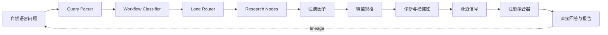
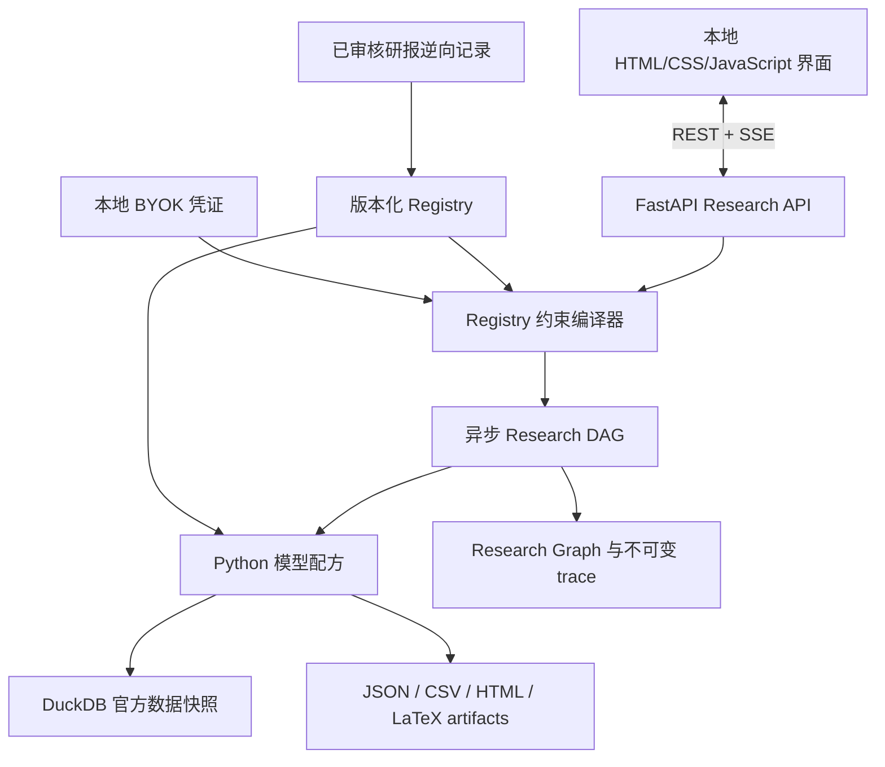

<div align="center">

# MacroTrace

### 把开放式美国宏观问题编译成真实数据模型、方法诊断与可追溯 Research Graph。

[](https://github.com/ZhenyuanPAN822/macrotrace/releases)
[](https://github.com/ZhenyuanPAN822/macrotrace/actions)
[](https://www.python.org/)
[](./LICENSE)
[](#快速开始)

[English](./README.md) · [快速开始](#快速开始) · [系统架构](#系统架构) · [继续逆向研报](#继续逆向研报)


</div>

## MacroTrace：让宏观 AI 真正开始跑实证

现有宏观 AI 的典型工作方式，大致分成两类：

- **Wind、iFinD 等数据终端中的 AI Agent**，更擅长搜索自有数据库，再整理数据、资讯和研报，生成语言层面的分析。它们可以高效解释已有信息，但通常不会围绕一个开放问题，自动组织并系统运行多组面板回归、时间序列与预测模型。
- **ChatGPT、Codex、Claude Code 等通用 AI 工具**，可以写代码并完成单次回归，但本身没有一套稳定、注册化的宏观研究框架。缺少明确指引时，往往只能从少量数据来源、单一指标或简单模型开始。

MacroTrace 想补上的是中间缺失的一层：**一套专门研究美国国内宏观经济的白盒实证系统。**

用户提出自然语言问题后，MacroTrace 会完成三件事。

### 1. 识别问题背后的经济机制

系统不会搜索几条数据就直接生成回答，而是识别问题涉及的通胀形成、货币政策传导、劳动力市场、信用周期、房地产、经济增长等机制，再把每个机制拆成可以观测和检验的组件。

### 2. 把顶级宏观研究逆向成可复用的研究通道

MacroTrace 使用标准化语义逆向 workflow，拆解机构研报、政策报告、论文、书籍和研究网页中的问题定义、机制框架、指标选择、数据组合、模型设定、诊断方法与判断规则，并把它们转化成可以复用的泳道、节点、因子、模型规格和聚合路径。

这条流水线可以持续处理数百乃至数千份来源；当前公开原型已经内置 **30 份新逆向档案**（10 份机构 PDF、10 个机构网页、10 篇基础论文或书籍）和最初 **11 份研报 Registry**。因此，面对一个新的美国宏观问题，系统不是临时发明研究方法，而是调用已经审核和注册的数据空间与实证路径。

### 3. 从机制组件逐层生成宏观观点

以美国通胀为例，系统会把问题拆成需求、劳动力市场、工资、生产率、住房、供应链、能源价格和通胀预期等组件，再分别执行实证分析、解释与预测，例如：

- 使用消费、零售销售、财政支出和信贷数据，运行 VAR 或 Local Projections，估计需求冲击对核心通胀的动态响应与持续时间；
- 使用职位空缺、离职率、失业率和工资数据，运行扩展 Phillips Curve 或面板规格，量化劳动力市场紧张度向工资和服务通胀的传导；
- 在存在合格横截面数据与注册路径时，使用州、行业或城市面板和固定效应模型，研究工资、生产率、租金与地区通胀差异；
- 使用消费者调查、市场盈亏平衡通胀率和历史通胀数据，通过状态空间或 Dynamic Factor 方法提取潜在预期与共同状态；
- 使用 VAR、Local Projections、面板回归、状态空间和经过审核的机器学习配方，对不同组件做参数估计、冲击分解、样本外检验和预测。

系统先把组件结果聚合成单一机制判断，例如需求通胀、工资通胀或住房通胀是否正在增强；再对不同机制的证据做交叉验证，形成一个明确但保留识别边界的综合宏观观点。

```text
自然语言问题 → 经济机制 → 机制组件 → 数据与模型 → 实证解释与预测
→ 机制判断 → 综合宏观观点
```

每一个最终结论都可以向下追溯到数据、变量、模型、参数、诊断和实证结果；每一项分析都可以打开查看对应的公式、回归过程、学术表格与 provenance。

当前公开的是已经可以本地运行的原型，而不是一个托管网页。它优先服务于：

- **小型买方、Family Office 与独立宏观投资者**：用真实、可追溯的实证研究，更快判断经济数据、政策变化和潜在资产价格传导；
- **投资顾问、Wealth Advisor 与 RIA**：从看得见的数据分析形成资产配置叙事，降低宏观研究、客户沟通和汇报成本；
- **缺少专职宏观研究员的 Crypto 与 DeFi 团队**：把利率、流动性、美元、通胀和风险偏好的变化，转化成可检查的宏观风险视图。

MacroTrace 是一个本地运行的白盒宏观研究编译器。你可以直接问：

> 美国联邦债务扩张是否正在增加十年期收益率压力？

系统会解析目标与期限，把问题路由到已注册的经济泳道，在白名单中选择因子和模型，用 Python 对官方真实观测执行统计分析，运行方法专属诊断，再把证据聚合成一个直接回答和一张可以逐节点展开的研究图。

大语言模型只做受限路由与证据解释：它不能临时写统计代码、发明变量或生成数值权重。

## 目录

- [为什么做 MacroTrace](#为什么做-macrotrace)
- [当前包含什么](#当前包含什么)
- [产品演示](#产品演示)
- [快速开始](#快速开始)
- [一个问题如何被编译](#一个问题如何被编译)
- [系统架构](#系统架构)
- [接入你自己的 API](#接入你自己的-api)
- [继续逆向研报](#继续逆向研报)
- [API](#api)
- [项目结构](#项目结构)
- [验证](#验证)
- [已知限制](#已知限制)
- [路线图](#路线图)

## 为什么做 MacroTrace

| 方案 | 开放式问题 | 真实统计执行 | 方法诊断 | 证据链可回溯 | Registry 约束 |
|---|---:|---:|---:|---:|---:|
| 普通宏观聊天机器人 | 可以 | 通常没有 | 没有 | 没有 | 没有 |
| Notebook / 一次性脚本 | 有限 | 有 | 取决于作者 | 部分 | 手工 |
| 固定指标 Dashboard | 不可以 | 有时有 | 很少 | 部分 | 固定 UI |
| **MacroTrace** | **可以** | **有** | **按方法声明** | **问题到结论** | **有** |

MacroTrace 面向经济学研究者、宏观分析师、学生和希望检查答案来源的技术型用户。它追求的是“可以复核的立场”，不是流畅但不可审计的文字。

## 当前包含什么

- 分层问题编译链：Query Parser、Workflow Classifier、Lane Router、Node Router、Factor Selector、Model Planner、局部 Parameter Agent 和 Evidence-bound Synthesis。
- 版本化研究 Registry：**10 条泳道、31 个机制、55 个因子、82 个模型规格、30 个研究节点与 6 类 Workflow**。
- 真实 Python 方法：Dynamic Factor / bridge nowcast、注册 VAR、Local Projection、Quantile Growth-at-Risk、bridge OLS、自回归基准和面板固定效应测试夹具。
- 方法专属 Results、Diagnostics、Robustness、学术三线表、图表、Provenance、参数决策和 artifact 哈希。
- Research Graph 始终保留未路由泳道，以高亮显示当前路径；任一最终 Claim 都能反向追到数据与规格。
- **30 份由 Codex 语义精读的逆向档案**：10 份机构 PDF、10 个机构网页、10 篇基础论文或书籍，并保留最初 11 份研报的 Registry。
- 首页内置“API 与数据源”窗口，可接 OpenAI、DeepSeek、Anthropic、Gemini、自定义 OpenAI-compatible 服务和美国官方数据凭证。
- 一个经过隐私清理的官方数据快照，作为独立 GitHub Release 资产分发。

## 产品演示


<details>
<summary><strong>动态演示</strong></summary>


</details>

## 快速开始

### 环境要求

- Windows 10/11 与 PowerShell
- Python 3.11 或以上
- 首次安装依赖和数据快照时可以联网

### 安装并打开

```powershell
git clone https://github.com/ZhenyuanPAN822/macrotrace.git
Set-Location macrotrace
powershell -ExecutionPolicy Bypass -File .\scripts\setup_mvp.ps1
powershell -ExecutionPolicy Bypass -File .\scripts\start_macrotrace.ps1
```

安装脚本会创建本地虚拟环境、安装依赖、从最新 GitHub Release 下载已审核的官方数据快照，并运行测试。启动脚本会打开浏览器，并让本地服务器持续运行在当前终端：

- 产品：`http://127.0.0.1:8000/`
- OpenAPI：`http://127.0.0.1:8000/docs`

需要停止时，在这个终端按 `Ctrl+C`。如果不希望自动打开浏览器：

```powershell
.\scripts\start_macrotrace.ps1 -NoBrowser
```

常用安装选项：

```powershell
# 不下载 Release 数据快照
.\scripts\setup_mvp.ps1 -SkipSnapshot

# 填写自己的数据 API 后同步最新官方数据
.\scripts\setup_mvp.ps1 -SyncData
```

## 一个问题如何被编译



固定的图节点协议是：

```text
QUESTION → QUERY → CLAIM → LANE → RESEARCH_NODE → FACTOR
→ DATASET → TRANSFORM → MODEL_RUN → DIAGNOSTIC → EVIDENCE
→ LANE_SIGNAL → AGGREGATION → FINAL_CLAIM → FALSIFIER
```

面对大问题，MacroTrace 可以在多条机制下安排数十个注册规格。描述统计、动量、分位数与 z-score 只能作为因子或基准证据，不能单独支撑大型宏观结论。

## 系统架构



数值分析由确定性的 Python 完成。LLM 可以理解研究问题和解释已经完成的证据，但不能绕过 Registry 兼容性规则，也不能修改公式代码。

## 接入你自己的 API

在首页打开 **API 与数据源**。Key 可以只保留在本次服务器内存中，也可以写入本机 `data/private/provider-config.json`；这个目录已经被 Git 忽略。

模型服务商预设：

- OpenAI
- DeepSeek
- Anthropic / Claude
- Google Gemini
- 自定义 OpenAI-compatible HTTPS endpoint

官方数据 Key 窗口包括 FRED、BLS、EIA、BEA 与 Census。当前快照使用的 Treasury 和 New York Fed 路径不要求用户 Key。前端包含申请链接、填写说明和连接测试。

不要提交 `.env.local`、`data/private/`、带有凭证的截图或原始服务商响应。

## 继续逆向研报

公开原型已经包含一批已审核的语义逆向记录。若要在本地添加论文或研报：

```powershell
.\.venv\Scripts\python.exe .\scripts\report_pipeline.py --help
```

逆向流程刻意拆成多个受控阶段：

1. 对来源做指纹并在私有目录逐页提取。
2. 语义精读，并建立“问题 → 泳道 → 机制 → 节点 → 因子 → 数据 → 模型 → 诊断 → 聚合”路径。
3. 运行独立的第二遍复核。
4. 检查页码、变量定义、方法适配和免费数据可得性。
5. 先生成不修改 live Registry 的 changeset。
6. 只有 content hash 完全匹配的已批准 changeset 才能事务化应用，并保留 rollback。

完整合同见[研报接入工作流](./docs/08_report_ingestion_workflow_v1.md)和[逆向抽取提示词](./report_pipeline/prompts/reverse_extraction_v1.md)。词频与自动摘要不能替代语义逆向。

## API

核心端点：

```text
POST /v1/research-jobs
GET  /v1/research-jobs/{id}
GET  /v1/research-jobs/{id}/graph
GET  /v1/research-jobs/{id}/events
GET  /v1/research-jobs/{id}/plan
GET  /v1/research-jobs/{id}/result
GET  /v1/research-jobs/{id}/trace
GET  /v1/research-jobs/{id}/nodes/{node_id}
GET  /v1/artifacts/{artifact_id}
POST /v1/research-jobs/{id}/cancel
```

示例：

```powershell
$body = @{
  question = "美国联邦债务扩张是否正在增加十年期收益率压力？"
} | ConvertTo-Json

$job = Invoke-RestMethod `
  -Method Post `
  -Uri http://127.0.0.1:8000/v1/research-jobs `
  -ContentType application/json `
  -Body $body

Invoke-RestMethod "http://127.0.0.1:8000/v1/research-jobs/$($job.job_id)"
```

## 项目结构

```text
backend/app/                 FastAPI、编译器、模型、诊断和异步任务
frontend/                    本地研究界面与 Research Graph
registry/v2/                 泳道、因子、模型、路由与 Claim Registry
report_pipeline/             已审核记录、提示词和示例
schemas/                     Research Job 与研报逆向合同
scripts/                     安装、启动、同步、研报逆向和验证
tests/                       统计、Registry、API 与安全测试
docs/                        架构、方法图谱与逆向工作流
```

## 验证

```powershell
.\.venv\Scripts\python.exe -m pytest -q
.\.venv\Scripts\python.exe -m compileall backend
node --check .\frontend\app.js
.\.venv\Scripts\python.exe .\scripts\validate_blueprint.py
```

Release builder 采用 fail-closed：一旦公开源码中出现疑似 secret、个人路径、环境文件、数据库、研究历史、缓存或日志，构建会直接失败。

## 已知限制

- 随 Release 附带的是已审核数据快照，不是持续维护的实时数据服务。
- `as-of` 过滤不会让所有来源自动变成完整的历史 vintage 仓库；修订风险会写入 provenance。
- 如果没有已注册的处理变量、反事实、数据集或识别设计，一些开放式问题仍会是 partial。
- 关联与预测证据不会被包装成已识别的因果效应。
- 当前面板固定效应流程仍是测试夹具，除非某条经过审核的研报路径明确激活它。
- 系统会阻止凭证进入 Git 与公开 API 响应，但选择“保存到这台电脑”的 Key 仍以明文本地保存。
- 本项目是研究软件，不构成投资建议。

## 路线图

- 增加更多经过审核的美国宏观 Workflow 和官方数据连接器。
- 加强真实 vintage 与 release calendar。
- 只有通过研报识别语境与合成 DGP 验证后，才激活新的因果模型。
- 增加跨平台启动脚本和可复现的本地容器模式。
- 加强模型集合校准和严格按时间顺序的样本外聚合。

## 许可证

[MIT](./LICENSE)。第三方数据仍受各自来源条款约束。

如果你认为这种白盒研究图有价值，可以给仓库点一个 Star，并用 Issue 提交当前 Registry 还不能诚实编译的宏观问题。
