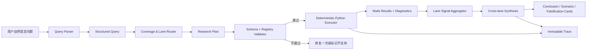
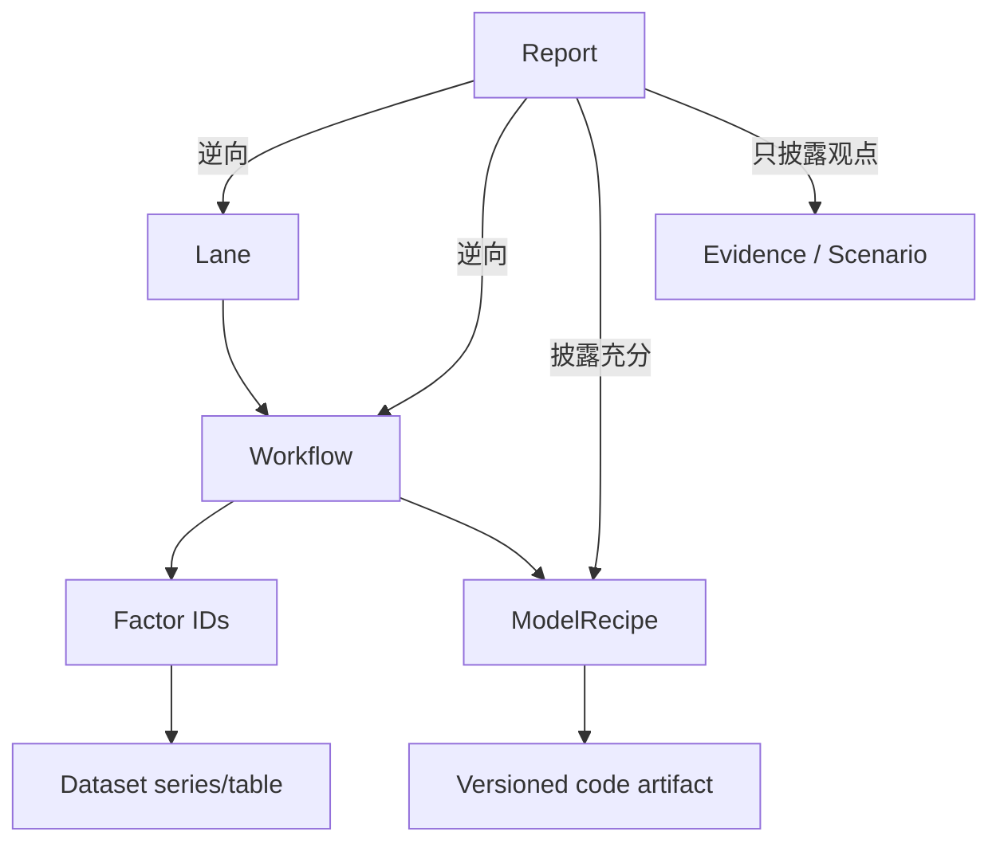

# MacroTrace 产品与系统框架 v0.1

## 1. 产品定义

MacroTrace 是面向美国宏观研究的“受限执行引擎”。用户可以用自然语言提出任意美国宏观问题，系统把问题翻译为结构化研究计划，从已注册的泳道、工作流、因子、模型和参数中选择组合，执行定量或规则分析，再把结果综合为带证据、置信度、风险情景和证伪条件的答案。

它不是：

- 为每一个问题临时写代码的 agent；
- 只会检索研报并生成摘要的 RAG；
- 只展示固定指标的传统仪表盘；
- 对任何问题都强行给出一个数值答案的黑箱预测器。

它的通用性来自模块的覆盖面与组合能力，不来自让模型随意改代码。

## 2. 第一版产品边界

| 维度 | 第一版决定 |
|---|---|
| 地域 | 只做美国；全球变量只有在影响美国时才进入 |
| 领域 | 只做宏观；包括宏观向利率、美元、股票、信用等资产的传导 |
| 时间 | 用户可指定任意合理时间窗和预测/分析期限，不写死月份 |
| 问题 | 自然语言开放输入，不预设标准问句 |
| 数据 | 第一波以免费官方 API 为主，原始数据先落到本地 |
| 运行 | 先在本地完成、验证，再改造成公开网站与付费产品 |
| AI 权限 | 只能选择、组合、排序和填写白名单参数；不能写或修改执行代码 |
| 输出 | 结论、证据链、泳道信号、冲突、情景、置信度、证伪条件和完整 trace |

## 3. 系统最重要的合同

### 3.1 开放问题，封闭执行

问题空间是开放的，执行空间是封闭且版本化的。AI 可以把一个问题拆成任意数量的研究子问题，但每个子问题必须路由到注册表中存在的工作流；否则标为 `UNSUPPORTED`。

### 3.2 AI 只输出 ID 和允许的参数

例如面板回归模块已经固定：

- 可选自变量：`X1`、`X2`、`X3`、`X4`；
- 可选固定效应：无、时间、实体、双向；
- 可选标准误：普通、实体聚类、时间聚类、双向聚类、Newey-West；
- 可选样本窗和预先定义的滞后数。

AI 可以输出：

```json
{
  "recipe_id": "PANEL_FE_V1",
  "x_ids": ["X1", "X2"],
  "window": {"start": "2012-01-01", "end": "2025-12-31"},
  "fixed_effects": ["ENTITY", "TIME"],
  "covariance": "CLUSTER_ENTITY",
  "lags": 2
}
```

AI 不可以输出新公式、Python、SQL、列名表达式或任意包名。执行器只接受 JSON Schema 验证通过、且 Registry 允许的组合。

### 3.3 结论必须可追溯

每条结论至少携带：

- 来源数据集、series/table ID 与抓取时间；
- `as_of_date`、观测期和数据 vintage；
- 因子定义与变换版本；
- 工作流、模型配方和代码 artifact 版本；
- 运行参数、样本量、诊断结果；
- 支持或反驳了哪个中间命题；
- 对最终结论贡献了多少，以及为什么。

## 4. 端到端流程



流程分成五层：

1. **A：问题理解。** 抽取对象、方向、期限、起点日期、分析类型和目标资产。
2. **B：研究规划。** 选择相关泳道，把问题拆成机制与可执行工作流。
3. **C：分泳道执行。** 每个泳道运行若干固定工作流，产生标准化节点结果与泳道信号。
4. **D：跨泳道综合。** 处理共同驱动、重复证据、冲突、传导过滤、政策反应与情景树。
5. **E：结果表达。** 生成结论卡、机制卡、证据卡、风险卡、证伪卡和执行 trace。

## 5. 核心对象模型

| 对象 | 作用 | 谁可以改变 |
|---|---|---|
| `Question` | 用户原始问题 | 用户 |
| `StructuredQuery` | 问题的结构化表达 | AI 生成，Schema 校验 |
| `Lane` | 一类宏观机制的长期容器 | 研究维护者版本化维护 |
| `Workflow` | 一个可复用分析链：数据→因子→方法→输出 | 研究维护者版本化维护 |
| `Factor` | 有唯一口径、频率和变换的经济变量 | 数据/研究维护者 |
| `ModelRecipe` | 固定实现与有限参数空间 | 量化开发者 |
| `ResearchPlan` | 本次问题选择了哪些模块和参数 | AI 生成，Validator 裁决 |
| `NodeResult` | 单节点的值、方向、诊断与证据 | Python 执行器 |
| `LaneSignal` | 单泳道的方向、强度、可信度和有效期 | 固定聚合器 |
| `Synthesis` | 跨泳道去重、冲突和传导结果 | 固定规则 + 受限 AI 解释 |
| `Claim` | 最终文本中的一个可验证命题 | AI 表达，Claim Validator 绑定证据 |
| `Trace` | 从问题到结论的不可变审计记录 | 系统自动记录 |

对象关系不是“研报→一个大 prompt”，而是：



## 6. A 层：问题结构化

`StructuredQuery` 至少包含：

- `jurisdiction`: 第一版恒为 `US`；
- `as_of_date`: 答案所处的信息集，不能默认偷看未来；
- `horizon`: 例如 1—3 个月、4 个季度或长期；
- `analysis_modes`: nowcast、forecast、driver、policy impact、scenario、asset transmission 等；
- `targets`: CPI、失业率、10 年期收益率等目标变量；
- `directional_claims`: 用户问的是水平、方向、加速、拐点还是因果；
- `conditioning_events`: 关税、油价冲击、财政扩张等条件；
- `asset_targets`: 若问题要求宏观向资产传导；
- `required_outputs`: 结论、概率、机制、情景、证伪等。

解析后必须先做 coverage：

- `FULL`：现有模块可以覆盖关键机制；
- `PARTIAL`：只覆盖一部分，结论必须收窄；
- `UNSUPPORTED`：核心机制没有可执行模块；
- `OUT_OF_SCOPE`：不是美国宏观或宏观传导问题。

## 7. B 层：从问题到研究计划

Planner 不直接决定结论，只生成候选 `ResearchPlan`。每一个计划项都必须说明：

- 它要验证哪个中间命题；
- 选择了哪个 `lane_id` 和 `workflow_id`；
- 为什么与用户问题相关；
- 数据能否覆盖 `as_of_date` 与所需窗口；
- 使用哪个固定配方和哪些合法参数；
- 预期输出会怎样影响最终判断；
- 缺失时采用哪个已注册 fallback，或直接降级。

计划经过三重验证：

1. JSON Schema：结构、类型、枚举、日期等是否合法；
2. Registry：ID、版本、参数组合、依赖关系是否存在且允许；
3. Feasibility：数据权限、频率、样本量和点时版本能否满足。

允许 AI 在校验失败后根据结构化错误修复一次。第二次仍失败就删掉该节点并返回覆盖缺口，不能让 AI 绕过验证器。

## 8. C 层：泳道与节点执行

泳道数量不是预先写死为五条。首批 11 份报告逆向后得到 12 条种子泳道，详见第二份交付；后续每批研报可提出新增、拆分或合并建议，但都要经过独立 Codex 语义复核、Registry 冲突审计和版本迁移。

每条泳道内部遵循同一接口：

```text
DataSnapshot
  → FactorTransform
  → Diagnostic/Model/Rule
  → NodeResult
  → EvidenceWeight
  → LaneSignal
```

`NodeResult` 的标准字段：

- `value` / `distribution` / `direction`；
- `unit`、`frequency`、`observation_end`、`vintage`；
- `effect_horizon` 和 `valid_until`；
- `sample_size`、缺失率与关键诊断；
- `evidence_type`: descriptive、associational、causal、structural、forecast、scenario；
- `result_status`: success、degraded、insufficient_data、failed；
- `supports_claim_ids` / `contradicts_claim_ids`；
- `artifact_refs`: 表、图、数据快照、模型输出和日志。

同一泳道的节点不能简单平均。聚合器按预注册规则考虑：

- 与问题的直接性；
- 方法识别强度；
- 数据新鲜度；
- 点时可用性；
- 样本和诊断是否达标；
- 多个节点是否在使用同一底层数据，防止重复计票；
- 信号适用的时间期限。

## 9. D 层：跨泳道综合

D 层不是再跑一遍大语言模型“凭感觉总结”，而是执行以下有状态步骤：

1. **归一化。** 把不同单位结果转成方向、强度、有效期和证据等级。
2. **证据去重。** 通过 `data_lineage_id` 和 `driver_id` 识别同源指标。
3. **主导驱动。** 识别哪些共同冲击同时驱动多个泳道。
4. **冲突检测。** 区分真实机制冲突、时间尺度不同和数据发布时间错位。
5. **传导过滤。** 例如通胀上行是否真的传到 10 年期收益率，还要经过增长、Fed 反应、期限溢价、避险需求与供给的过滤。
6. **政策反应。** 评估 Fed 或财政当局是否内生抵消初始冲击。
7. **情景树。** 至少产生基准、上行、下行情景，各自有触发条件。
8. **Regime。** 标记当前更接近需求驱动、供给冲击、滞胀、衰退/避险等状态。
9. **Conviction。** 输出离散等级与构成原因，不制造虚假精确概率。
10. **证伪条件。** 明确哪些未来发布或阈值会让结论失效。

### 9.1 置信度不是一个随意分数

第一版建议输出 `LOW / MEDIUM / HIGH`，并分解展示：

- coverage；
- data freshness；
- model diagnostics；
- cross-lane agreement；
- vintage integrity；
- narrative dependence。

只有经过历史校准后，才把置信度转成概率。

## 10. E 层：用户看到的产品

结果页面建议由六张固定卡片构成：

1. **Answer Card**：一句话回答、方向、期限、置信度和截至日期；
2. **Mechanism Map**：哪些泳道推动、抵消或尚不确定；
3. **Evidence Cards**：关键图表、估计结果、来源与解释；
4. **Scenario Card**：基准/上行/下行及触发器；
5. **Falsification Card**：未来哪些数据会推翻结论；
6. **Trace Card**：使用的模块、参数、数据 vintage、失败节点和覆盖缺口。

自然语言结论中的每个定量 claim 必须绑定 `evidence_id`。Claim Validator 检查：

- 数值是否存在于执行产物；
- 方向与结果是否一致；
- 单位、期限和样本是否被正确表述；
- descriptive 结果是否被错误写成 causal；
- 情景预测是否被错误写成确定事实。

## 11. Registry 设计

第一版至少有八类注册表：

| Registry | 关键内容 |
|---|---|
| Lane | 泳道定义、边界、相互传导关系 |
| Workflow | 分析目的、节点顺序、输入输出、fallback |
| Factor | 经济定义、source series/table、频率、变换、修订属性 |
| Dataset | API、认证、抓取方式、发布日期、vintage 能力、许可 |
| ModelRecipe | 固定 artifact、允许参数、最小样本、诊断门槛 |
| Evidence | 研报观点、历史事实、制度知识和不可执行预测 |
| Scenario | 冲击定义、范围和适用泳道 |
| Report | 研报逆向来源、页码、复现状态和美国适用性 |

所有 registry item 都有：

- 稳定 ID 与语义版本；
- `draft / reviewed / active / deprecated / blocked` 状态；
- owner、创建/审核时间；
- 适用范围和禁止使用范围；
- 来源页码或官方文档；
- 测试、依赖和替代项；
- 变更记录。

## 12. 模型配方的安全边界

模型配方采用“代码 artifact + JSON 参数”而非动态代码。一个配方需要固定：

- 因变量和候选自变量集合；
- 变换方式及顺序；
- 估计器与库版本；
- 允许的样本窗口、频率、滞后和固定效应；
- 缺失值和异常值处理；
- 标准误和权重方案；
- 最小样本、共线性、稳定性和残差诊断；
- 输出格式和失败条件；
- 单元测试、golden fixture 与历史回归测试。

明确禁止：

- 任意 Python/R/SQL；
- 任意公式字符串；
- 任意列名、URL、文件路径或包安装；
- 注册表以外的因子；
- 自动把失败诊断改成成功；
- 用全样本修订后数据进行声称为“实时”的回测。

## 13. 本地 MVP 技术架构

为了先本地跑通、又不锁死未来上线，采用接口与 adapter 分离：

| 层 | 本地 MVP | 上线替换方向 |
|---|---|---|
| Web UI | Next.js，本地浏览器 | 同一前端部署到 CDN/边缘 |
| API/编排 | FastAPI + Pydantic | 多实例 FastAPI |
| Registry/任务元数据 | SQLite | PostgreSQL |
| 分析仓库 | DuckDB 查询 Parquet | DuckDB/ClickHouse/warehouse adapter |
| 原始数据 | 本地分区 Parquet/JSON | S3 兼容对象存储 |
| 任务执行 | 单机 Python worker，子进程隔离 | Redis 队列 + 多 worker |
| 缓存 | 本地内容寻址缓存 | Redis + 对象存储 |
| LLM | provider adapter + JSON Schema | 多模型路由、配额和降级 |
| 可观测性 | 结构化 JSON log + trace 文件 | OpenTelemetry + 集中日志 |

建议仓库边界：

```text
apps/web                 用户界面
services/api             查询、任务、结果 API
services/worker          确定性执行器
packages/contracts       Pydantic/JSON Schema
packages/registry        Registry 读写与版本管理
packages/data_connectors 官方 API 连接器
packages/factors         固定因子变换
packages/models          固定模型配方
packages/synthesis       证据聚合、冲突与情景规则
data/raw                 原始不可变响应
data/curated             标准化长表 Parquet
artifacts/runs           每次运行的完整产物
tests/golden             固定输入/输出回归测试
```

## 14. 运行状态与失败语义

任务状态机：

```text
RECEIVED → PARSED → PLANNED → VALIDATED → QUEUED → RUNNING
         → SYNTHESIZING → COMPLETE | PARTIAL | FAILED
```

- `COMPLETE`：必要节点成功且 coverage 达标；
- `PARTIAL`：仍能回答，但存在明确覆盖缺口或降级数据；
- `FAILED`：核心节点失败，不能诚实回答；
- 节点失败不能被自然语言层隐藏；
- 相同 question、as-of、registry version、data snapshot 和参数应得到相同执行结果。

## 15. 最小 API 合同

本地 MVP 需要的外部接口不多：

- `POST /v1/research-jobs`：提交自然语言问题、as-of 与可选 horizon；
- `GET /v1/research-jobs/{id}`：任务状态与 coverage；
- `GET /v1/research-jobs/{id}/plan`：结构化计划和校验结果；
- `GET /v1/research-jobs/{id}/result`：卡片化答案；
- `GET /v1/research-jobs/{id}/trace`：完整可审计执行链；
- `GET /v1/registry/{type}`：查看 active 版本；
- `POST /v1/admin/registry/proposals`：提交新增模块草案，不直接激活。

## 16. 研报逆向进入产品的流程

每份报告不是简单标几个关键词，而要经过：

1. 提取报告元数据、目录、图表、附录和方法段；
2. 把作者的研究问题拆成经济机制；
3. 把机制归一到现有泳道，必要时提出新泳道；
4. 对每个分析拆出数据、因子、变换、方法、参数、诊断和输出；
5. 判断方法披露是否足以成为可执行配方；
6. 标记美国适用性：`US_DIRECT / US_ADAPTABLE / OUT_OF_SCOPE`；
7. 标记免费数据可得性与付费依赖；
8. 对可复现模块写单元测试和 golden result；
9. 第二遍独立 Codex 语义复核、复现门和完整测试通过后才从 `draft` 转为 `active`。

如果一份研报只有预测表、观点或图表，但没有足够模型定义，它仍然有价值，但只能进入 Evidence/Scenario Registry，不能冒充已复现模型。

## 17. MVP 验收标准

第一版不是以“回答看起来像研报”为验收，而是以以下条件验收：

- 三类不同问题都能从自然语言形成合法计划；
- 不合法 ID、变量、固定效应和窗口均被拒绝；
- 至少 5 条核心泳道有真实免费数据；
- 至少 8 个固定工作流能完整执行；
- 至少 3 类模型配方通过 golden test；
- 支持 as-of 运行，能区分实时 vintage 与最终修订值；
- 每条定量结论能点回数据、参数、代码版本和图表；
- 节点失败时答案明确降级，不编造补全；
- 同一运行快照可重现；
- 首个纵向切片能够回答通胀→Fed/期限溢价→10 年期收益率的完整链路。

## 18. 推荐实施顺序

1. 建 contracts、Registry loader、Validator 和 run artifact 规范；
2. 接 FRED/ALFRED、BLS、BEA、EIA、Treasury 与 Fed 数据；
3. 建 `US.INFLATION`、`US.LABOR`、`US.MONETARY`、`US.COMMODITY_ENERGY`、`US.FISCAL_TREASURY` 五条首发泳道；
4. 实现 descriptive、threshold/rule、panel FE、local projection、VAR/BVAR 五类通用配方；
5. 跑通“通胀是否加速→10 年期收益率”纵向切片；
6. 加点时回测、校准与回归测试；
7. 再扩展到全部 12 条泳道和公开网站。
